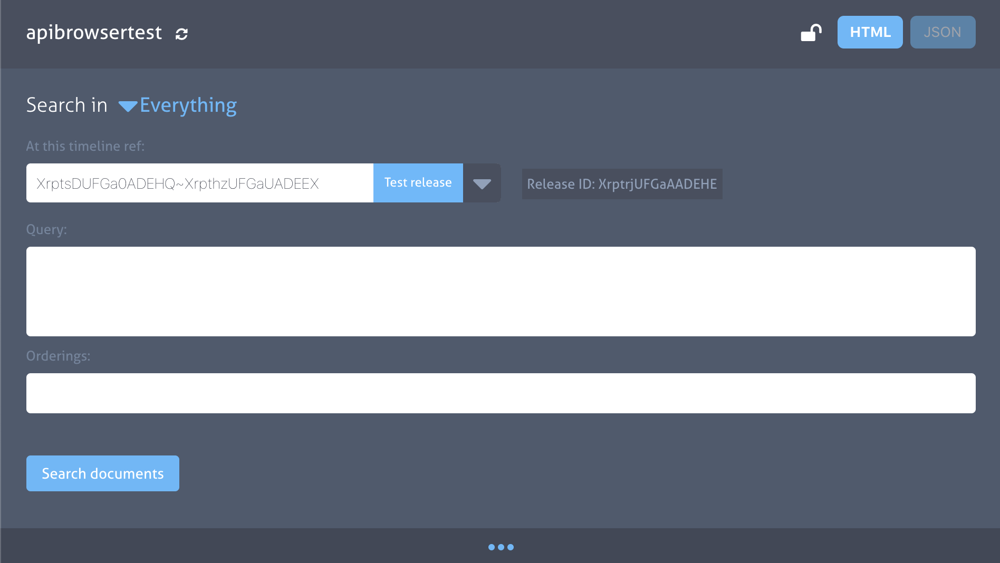
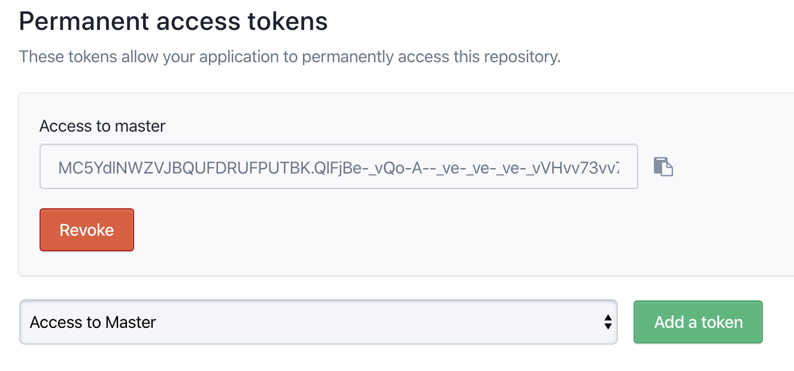
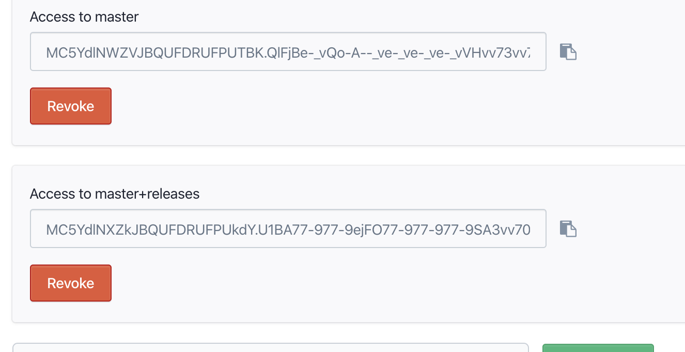
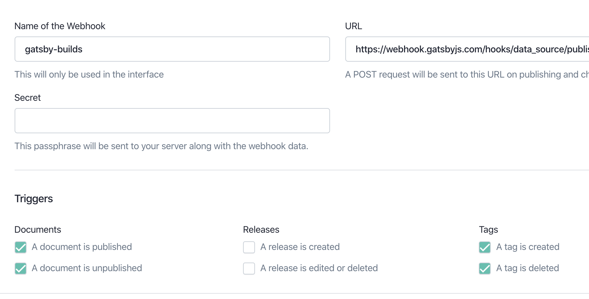

# Getting started with Gatsby Cloud and Prismic

## What is Gatsby Cloud and Prismic, and why use them together?
[Prismic](https://prismic.io) is a headless CMS that content editors can use to edit and publish content. Gatsby Cloud allows you to integrate your site with Prismic in order to run efficient builds and preview content changes made in the CMS before publishing.

## Create a and configure a Prismic project
If you've not already done so create an account with [Prismic](https://prismic.io).For this set of instructions we'll be using the [prismic-cli](https://github.com/prismicio/prismic-cli).The cli can be installed with `npm install -g prismic-cli`. 

These steps will help you create a prismic repository, 
1. Login to prismic-cli with you username and password `prismic login`.
2. Run the theme command to use this project a starter `prismic theme --theme-url https://github.com/MarcMcIntosh/gatsby-multi-language-site`.
3. choice a name for your repository and update it in the `prismic-configuration.js`

4. Go to [prismic.io](https://prismic.io) and select dash board and find the repository in the dashboard.
5. Select the repository in the dash board and select the master language.
6. Update `prismic-configuration.js` with the master language in the `defaultLanguage` property.
7. Create/Edit some content with in prismic using the custom-types and publish.
8. Edit the content, save and select publish and the publish in a release, create an new release to use with gatsby preview server. In order to do this you will need the release id.

The release id can be found in the api browser. `repo-name.prismic.io/api` clicking the dropdown arrow to select a ref. 

Alternatively release ids can be retrieved after creating the access tokens in the next step buy using the this script [/fetchReleaseIds.js](./fetchReleaseIds.js) `node fetchReleaseIds`.

### Create api tokens.
To generate a token, follow these steps:
1. Go to your repository's Settings / API & Security.
2. At the bottom find the section called "Generate an Access Token".
3. Add an application name. This doesn't matter much, you can add something like "My Website"
4. Click the "Add this application" button

This will generate the tokens which you can find under the "Permanent access tokens" section.

5. This will be the token to use on the gatsby-build/production server

To user the preview for a release we need to create a new token.
+ In the option bar select master+release and then click "Add a token"
6. The master+release will be the api token to use for gatsby's preview service.

These Tokens a be set in the `prismic-configuration.js` or through environment variables in gatsby-cloud.

### Run you project locally
To see the content from the published api run `npm start`,
and to see the content form the release run `GATSBY_CLOUD=true npm start`

## Learn how to connect Gatsby Cloud with Prismic

## Signing in to Gatsby Cloud
Select Sign in with GitHub. You’ll be asked to authorize the Gatsby Cloud app with your GitHub account. If you need to request access to one or more repositories, you can click “request access” here or later, when creating an instance.

Once signed in, configuring Gatsby Cloud with Prismic requires several steps that are walked through below.

## Creating an instance
Once you’ve authenticated with Cloud and GitHub, you can create an instance from the [“Create a new Gatsby Cloud site”](https://gatsbyjs.com/dashboard/sites/create) page.

Use the “I already have a Gatsby site” flow to manually integrate your site.

Pick your Gatsby site from the list of GitHub repositories. You can use the search input to narrow down the list.

If you don’t see your site, it might be because it belongs to a GitHub organization, rather than your personal account. You can connect a new GitHub Organization.

*Note: Repositories must contain one Gatsby project configured at their root to be enabled. Gatsby Cloud works best with Gatsby version 2.20.16 and higher.*

## Select branch and publish directory
You’ll need to select a branch and then indicate the publish directory where the gatsby-config.js lives. If you leave the field blank, it defaults to the root of the site.

Once the branch and base directory are correct, select “Next.”

## Create the instance

### Manual Integration
First, click “Skip this step” to configure Prismic manually.

Gatsby Cloud will automatically try and detect environment variables necessary in your gatsby-config.js. However — consider adding any additional variables that automatic detection may have missed. See [“Setting up Environment Variables”](#Setting up Environment Variables) for more info.

Note that you will be able to add, delete, or update these later on in [“Site Settings”](#Setting up Environment Variables).

Once you’ve added the necessary environment variables, you can press “Create site” which will create your instance in Gatsby Cloud!

### Site is Created

After following the “Automatic Integration” or “Manual Integration” flow you now have an instance of Gatsby Cloud configured with environment variables and a provided Gatsby Preview instance you can share with your team. Woo-hoo!

### Setting up Environment Variables

An environment variable references a value that can affect how running processes will behave on a computer, for example in staging and production environments. You must save environment variables in Gatsby Cloud to authorize your instance to pull source data from Prismic.

__You will need to add into Gatsby Cloud any environment variable required for your app to run, such as deployment or test environment configuration settings.__

__You will also need to add in the following Gatsby Cloud-specific environment variables:__

| Variable | Description |
| -------- | ----------- |
| `PRISMIC_REPO_NAME` | prismic repository name |
| `PRISMIC_API_KEY` | required if prismic api access token |
| `PRISMIC_PREVIEW_PATH` | a route to handle redirects from prismic to gatsby-preview |
| `PRISMIC_RELEASE_ID` | A prismic release id to build in gatsby-previews |

## Webhooks: Configuring your Gatsby site to work with Gatsby Cloud

### Setting up a webhook in Prismic
To make a connection between prismic and Gatsby Cloud for your site, you’ll need to configure webhooks in prismic so that content changes can be pushed to Gatsby Cloud.

You can add and edit necessary webhook information in two places in Gatsby Cloud:
+ During the “Create a new Site” process
+ After setting up an instance, on that instance’s Settings page

[Prismic documentation on webhooks](https://user-guides.prismic.io/en/articles/790505-webhooks)

### Adding a Preview Webhook for releases
Navigate to your Gatsby Cloud instance and click __Site Settings__. Copy the Preview Webhook on this page.

In your Prismic repository, go to __settings > webhooks__ and click __Create a webhook__.

Name the webhook and paste the Preview webhook into the URL address field.

And click __add this webhook__

The default triggers are fine for the preview instance.

### Adding a webook for the gatsby-builds instance.

Then create another webhook for the using the build url from gatsby, and de-select"the "release is created" and "release is edited or deleted` options and now the production build will automatically update when changes happen to the content in prismic.

The configuration should look something like this 

## Wrapping Up
At this point, you now have a prismic repository configured to best support Gatsby Cloud. Edit content and watch it appear live in Gatsby Cloud!
